# Devhub- Social Media Site

# Project Overview:

## Index Table

1. [Key Features](#key-features)

2. [UX](#ux)

3. [Wireframes](#wireframes)

4. [User Stories](#user-stories)

5. [Database design](#database-design)

6. [Kanban Board](#kanban-board)

7. [Scope](#scope)

8. [Testing](#testing)

9. [Deployment](#deployment)

10. [Bug Fixes](#bug-fixes)

11. [Credits](#credits)

12. [Frameworks](#frameworks)

13. [Languages Used](#languages-used)

14. [Future Features](#future-features)

15. [Acknoledgements](#acknoledgements)

## Key Features:

+ 

## UX:

+ 

## Wireframes:
Home page  

Post detail page  

Login page  

Logout page  

Sign up page  

Profile page  

Profile list page  

## User Stories:

### Epic User Management:
+ Sign Up- As a user, I want to sign up for an account using my username and a password.  
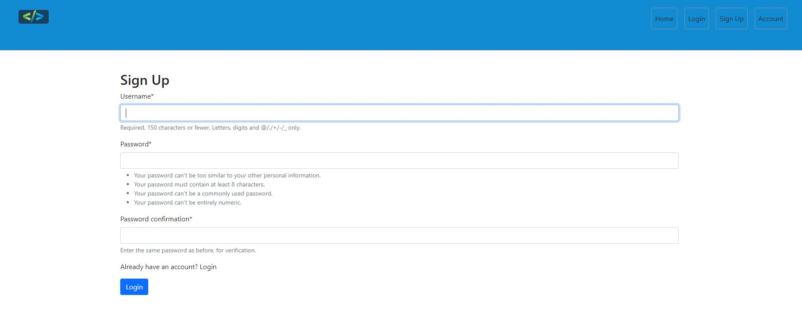

+ Login- As a user, I want to log in to my existing account.  

+ Logout user- As a user, I want to logout with a are you sure request before logging out.  
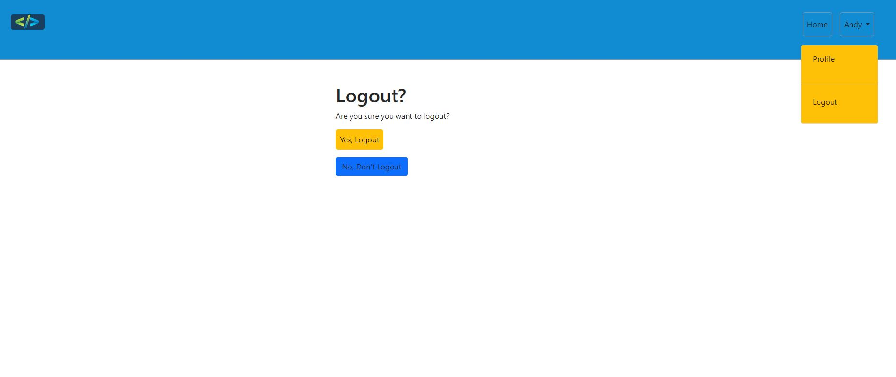

+ Notifactions- As a user, I want to receive notifications for confirmation of e.g login/out.  

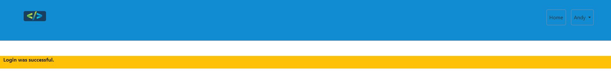

+ View my profile- As a user, I want to view my profile and see my posts, followers, and following.  
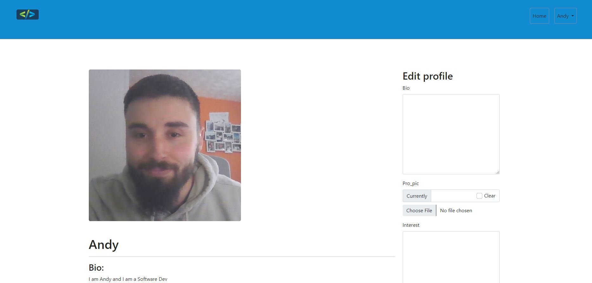

+ Edit my profile- As a user, I want to edit my profile information.  
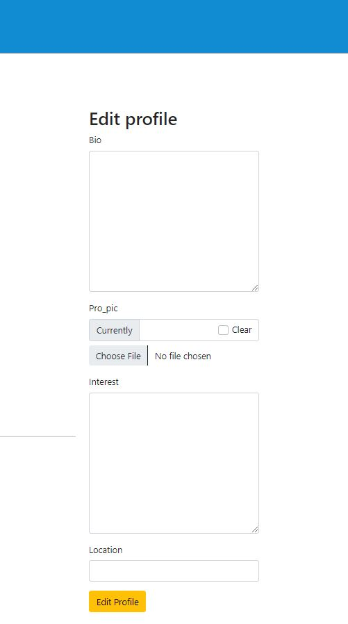

+ Account shown in nav- As a user, I want to be able to be notified I am in my account by seeing the username in the navbar.  
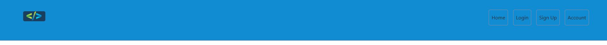
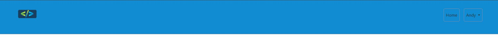

### Epic Conent Management:
+ Responsive website- As a user, I want to use the site for all devices.  
Iphone XR  

  
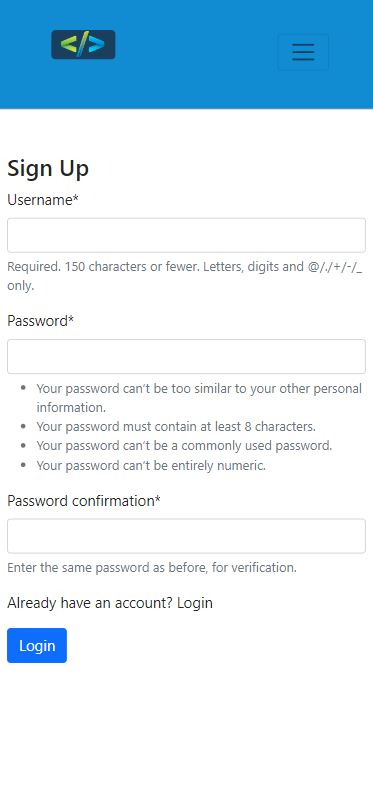

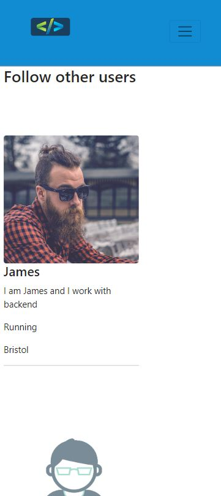
  
Ipad Pro  
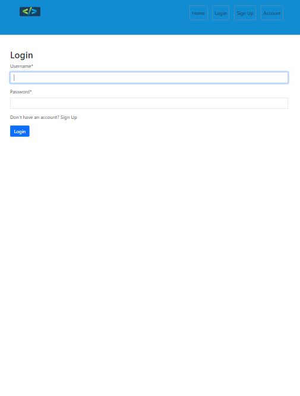
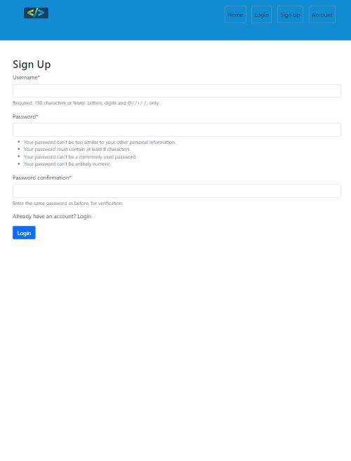

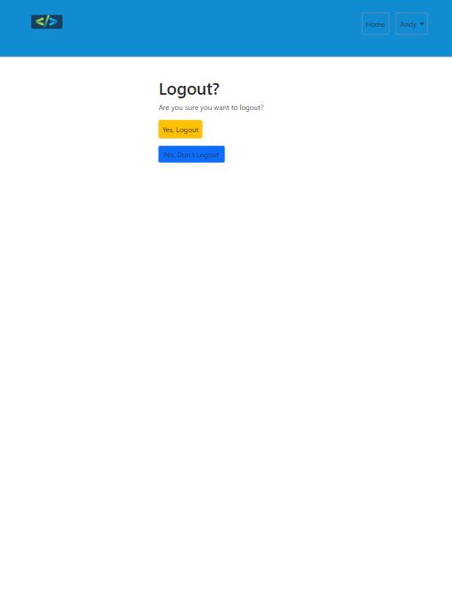

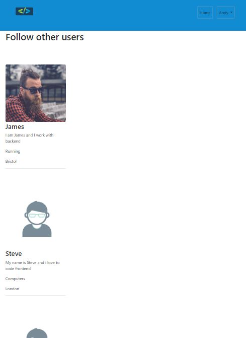  
4K 2560px screen    

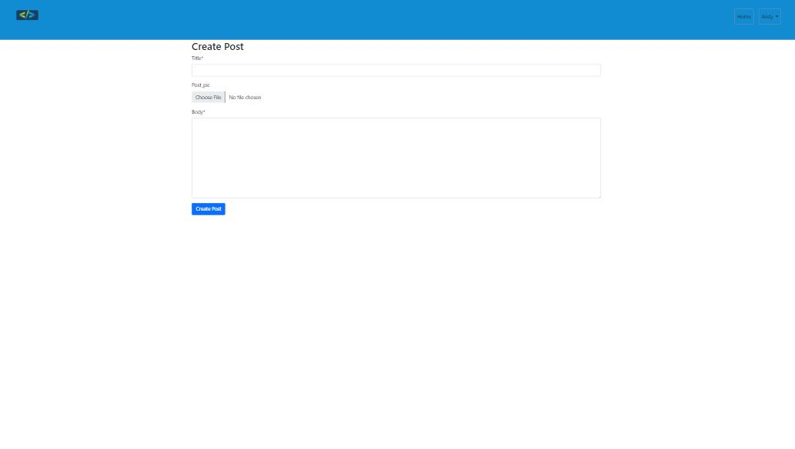

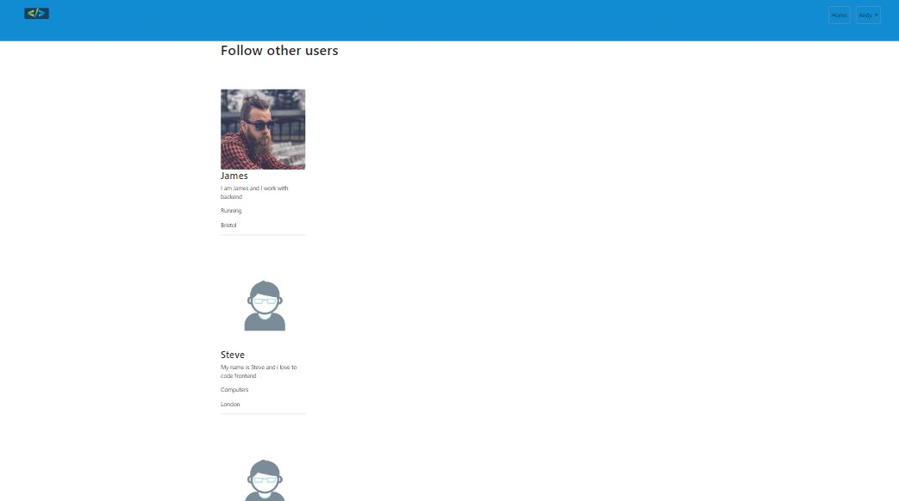

+ Admin CRUD- As an owner, I want to access the admin of the site to be able to Create/Read/Update/Delete all of the data add to my site.  

+ Delete posts- As a user, I want to delete my posts if I no longer want to share it.  

+ Edit posts- As a user, I want to edit my posts if a mistake was made.  
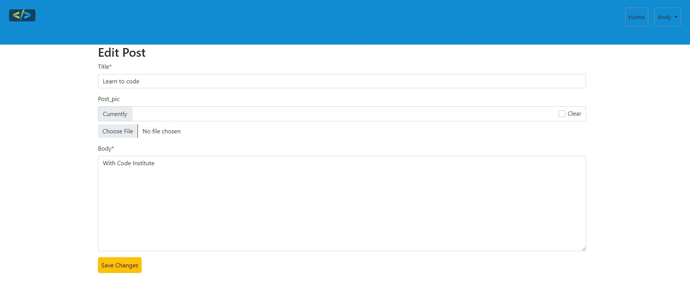

+ Create a profile- As a user, I want a profile with a username, bio, and profile picture.  
   - Profile is automatic made when you sign up.

+ Search bar- As a user, I want to search for other users by username.  
   - This function has been added to future features and didnt make it into the sprint and remained in the backlog

### Epic Social Interaction:
+ Comment on post- As a user, I want to comment on posts to share my thoughts or ask questions.  

+ Like posts- As a user, I want to like posts from other users.  
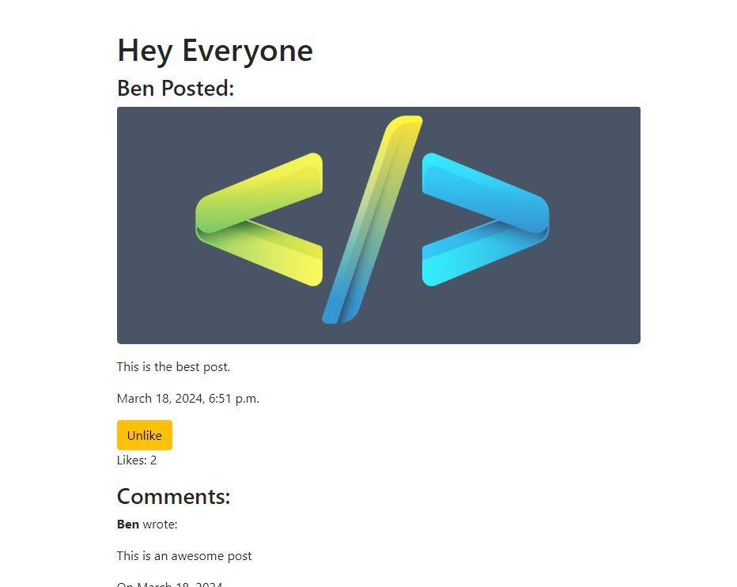

+ Create Posts- As a user, I want to create posts that can include text and images.  
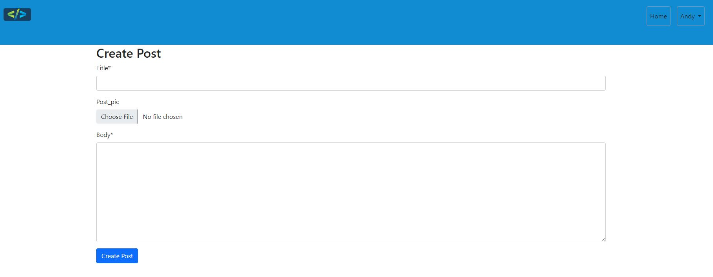

+ View other user profile- As a user, I want to view profiles of other users and see their posts.  

+ DM messages- As a user, I want to send private messages to other users.  
   - This remained in the out of the site and was a won't have. It has been added to the future features.

+ Follower feed post- As a user, I want to see a feed of posts from the people I follow.  
   - Didn't have time to sort this user story as stuck to MVP, in future features.

+ Following users- As a user, I want to follow other users to see their posts in my feed.  
   - This user story is the same and the follower story, in regards to order of MVP.

+ Unfollow users- As a user, I want to unfollow users I no longer want to see posts from.  
   - Added to future features for development on next sprint.

## Database design

## Kanban Board

## Scope

## Testing:

+ You can reference the Testing.md page for a full breakdown of the site manual tests that have been preformed.

## Deployment:

1. Our deployment platform:
   - The application has been deployed on GitHub.
2. Connect your GitHub repository to the platform:
   - Authorize the platform to access your repository and choose the specific branch to deploy (main). 
3. Verify deployment:
   - Accessed the project URL and tested it thoroughly to ensure everything works as expected.

## Bug Fixes:

+ 

## Credits:

+ https://www.freepik.com/free-photos-vectors/logo- Freeoik use to source images for logo and user profile pictures
+ https://ui.dev/amiresponsive- To showcase the site for my README.md
+ Git: was used for version control by utilising the Gitpod terminal to commit to Git and Push to GitHub.
+ GitHub: is used as the repository for the project's code after being pushed from Git and for UX Kanban Board.
+ Balsamiq: was used to create the wireframes during the design process.
+ Stackoverflow was used to get advice from software developers.
+ Google Gemini: used throughtout the project to read my code and help improve errors. Also used to help plan out my logic and my models.
+ https://www.w3schools.com/django/index.php- Used W3Schol throughout the whole project for reference to django and css.
+ https://developer.chrome.com/docs/lighthouse/pwa/pwa-cross-browser- lighthouse use to see how well the site functions.
+ https://realpython.com/build-a-blog-from-scratch-django/- Real python site use to follow steps to make a basic blog walkthrough.
+ https://www.youtube.com/watch?v=xSUm6iMtREA&t=12577s- Social media app walkthrough with free code camp.
+ https://www.youtube.com/watch?v=FdVuKt_iuSI&t=1915s- Youtube walkthrough for ideas for profile.
+ https://www.youtube.com/watch?v=RhJIMUMJ_Do&t=140s- Youtube walkthrough for static files.
+ https://www.youtube.com/watch?v=CQ90L5jfldw&t=38s- Youtube walkthrough for updating user profile.
+ https://dbdiagram.io/d- To design my database models.

## Frameworks:

+ Bootsrap 5 - https://getbootstrap.com/
+ Simple css - https://simplecss.org/
+ Django - https://www.djangoproject.com/

## Languages Used

+ HTML
+ CSS
+ Python

## Future Features:

+ DM messages- As a user, I want to send private messages to other users.  
   - This remained in the out of the site and was a won't have. It has been added to the future features.

+ Follower feed post- As a user, I want to see a feed of posts from the people I follow.  
   - Didn't have time to sort this user story as stuck to MVP, in future features.

+ Following users- As a user, I want to follow other users to see their posts in my feed.  
   - This user story is the same and the follower story, in regards to order of MVP.

+ Unfollow users- As a user, I want to unfollow users I no longer want to see posts from.  
   - Added to future features for development on next sprint.

+ + Search bar- As a user, I want to search for other users by username.  
   - This function has been added to future features and didnt make it into the sprint and remained in the backlog

## Acknowledgements

+ Thanks to my fellow Code Institute students for all the support and a special thanks to Ben Fashan for constant support and help for past two weeks of final project.
+ Thanks to Iris Smok for all the constant support.