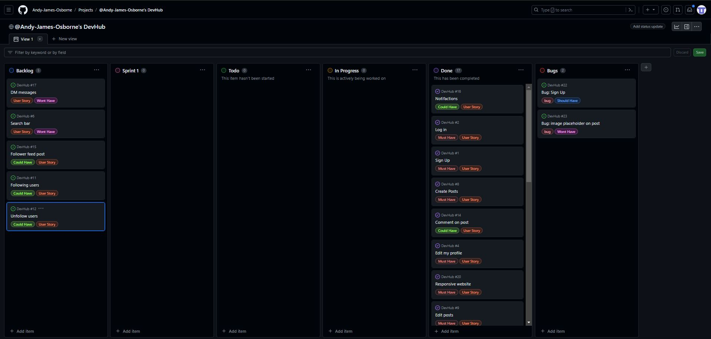

# Devhub- Social Media Site

# Project Overview:

This is a Full-Stack project with the use of django for the framework. I had two weeks to design and create a site. The choosen project was a social media site with the idea to be able to connect user with each for social interaction. Due to the sort time for this project the are a few features that I would include in the next sprint of this project to get it the standard of a full functing site. However I have completed all MVP requirements within the timeframe and used KISS (keep it simple silly) with some features to ensure the site is was ready for deployment.

+ Key Features:
   - Post feed for all users to see.
   - Interactive post feed to show post details once clicked on
   - All users can make their own post once they have logged in
   - Are only able to view the post feed page if not created an account
   - Sign in function allows users to have their own profile page which they can edit themseleves
   - Able to view other user info once logged in in a profile list of other users
   - Users have the ability to edit and delete their own post
   - Users can comment on other users post
   - Users can like other users post
   - Image are able to be upload from their desktop to the image fields in the profile and post forms

## Index Table

1. [Key Features](#key-features)

2. [UX](#ux)

3. [Wireframes](#wireframes)

4. [User Stories](#user-stories)

5. [Database design](#database-design)

6. [Kanban Board](#kanban-board)

7. [Scope](#scope)

8. [Testing](#testing)

9. [Deployment](#deployment)

10. [Bug Fixes](#bug-fixes)

11. [Credits](#credits)

12. [Frameworks](#frameworks)

13. [Languages Used](#languages-used)

14. [Future Features](#future-features)

15. [Acknoledgements](#acknoledgements)

## UX:
### Design of site
I have kept with simple colours with a white background to make the website stand out without being too bright.
   - #252525
   -  #118cd3
   - #ffc107

+ I have used Bootstraps Primary colours of "btn-primary and btn-warning" throught my website for easy of use not to over complicate the design and aim for a higher functioning website.
+ This was decided early on to able me to focus on the database and functionality of the website. 
+ I also used a cdn simply css to help with styling of the site.
+ I have decided on the Bootstrap font-family that comes as standard as i know this is well tested and will work on most devices and browsers.
+ Also used colour which was selected from the colour wheel.  

## Wireframes:
Home page  

Post detail page  

Login page  

Logout page  

Sign up page  

Profile page  

Profile list page  

## User Stories:

### Epic User Management:
+ Sign Up- As a user, I want to sign up for an account using my username and a password.  

+ Login- As a user, I want to log in to my existing account.  

+ Logout user- As a user, I want to logout with a are you sure request before logging out.  

+ Notifactions- As a user, I want to receive notifications for confirmation of e.g login/out.  

+ View my profile- As a user, I want to view my profile and see my posts, followers, and following.  

+ Edit my profile- As a user, I want to edit my profile information.  

+ Account shown in nav- As a user, I want to be able to be notified I am in my account by seeing the username in the navbar.  

### Epic Conent Management:
+ Responsive website- As a user, I want to use the site for all devices.  

+ Admin CRUD- As an owner, I want to access the admin of the site to be able to Create/Read/Update/Delete all of the data add to my site.  

+ Delete posts- As a user, I want to delete my posts if I no longer want to share it.  

+ Edit posts- As a user, I want to edit my posts if a mistake was made.  

+ Create a profile- As a user, I want a profile with a username, bio, and profile picture.  

+ Search bar- As a user, I want to search for other users by username.  

### Epic Social Interaction:
+ Comment on post- As a user, I want to comment on posts to share my thoughts or ask questions.  

+ Like posts- As a user, I want to like posts from other users.  

+ Create Posts- As a user, I want to create posts that can include text and images.  

+ View other user profile- As a user, I want to view profiles of other users and see their posts.  

+ DM messages- As a user, I want to send private messages to other users.  

+ Follower feed- As a user, I want to see a feed of posts from the people I follow.  

+ Following users- As a user, I want to follow other users to see their posts in my feed.  

+ Unfollow users- As a user, I want to unfollow users I no longer want to see posts from.  

## Database design

## Kanban Board

## Testing:

+ You can reference the Testing.md page for a full breakdown of the site manual tests that have been preformed.

## Deployment:

1. Our deployment platform:
   - The application has been deployed on GitHub.
2. Connect your GitHub repository to the platform:
   - Authorize the platform to access your repository and choose the specific branch to deploy (main). 
3. Verify deployment:
   - Accessed the project URL and tested it thoroughly to ensure everything works as expected.

## Bug Fixes:

### Production bugs:
+ Logo image: The logo for my website in the top corner was not rendering on the screen. The path from static files was wrong.
   - Solution: Fixed by updating link in the path on the html page inside the img tag was an error in spelling jpg.  
+ Login automatically: Doesn't login automatically once sign up has been completed.
   - Solution: Not fixed, still a bug with site, however the site redirect to login page once sign up so does effect user experience.
+ Image placeholder: No placeholder image for if user does not add a image to the post or profile. 
   - Solution: Not fixed, need to add placeholder image to the project for post creation and profile.
+ Logout confirm: When logging out the user didn't have a confirm to ensure they wanted to logout.
   - Solution: Fixed by added another html page called logout with an extention to my views.py function to enable a request.method = 'POST'.
+ Profile editing: Tried to allow users to edit there profiles once signed up.
   - Solution: Fixed wanted uses to sign up and instantly make a profile. Once they click the profile page edit the image and text fields, had an error on my html page with my POST form as had action='POST' instead of method='POST'.
+ Edit and delete comments: Editing and deleting comment function not working when trying to render into post_detail.html page.
   - Solution: My function in my views.py file works with models if I change the  to  however this allows every user to edit and delete anyones comment.
+ A tags: My link tags in html for login and sign up do not heighlight to show users they are clickable.
   - Solution: Added text-decoration back to these tags to show user they are clickable.
+ Edit profile: Need information that is already on profile to render in form when edit at the moment the fields are blank when you edit the profile form.
   - Solution: Needed to add this in the if statement of my edit profile views.py function 'form = ProfileForm(instance=request.user.profile)'.
+ Comment on posts: Stop working when added like if statement to post_detail function in my views.py file.
   - Solution: Had to rearrange the if statements in the function as the likes if statement was in wrong position.
### Responsive Testing:
+ Lougout: When testing the responsiveness the logout image is slightly off middle of page.
   - Solution: Add a media queiry so when on moblie view the logout is position center.
+ Profile image: Slightly squashed in mobile view.
   - Added a media queiry so before the image start to get squashed it resizes.
+ Home page buttons: On the home page the buttons on the side of the post feed relocate to the bottom of the page on mobile screens this is because of bootstrap cols.
   - This was a problem due to if the post feed gets very long it would take a long time to find these buttons. Fixed by keeping buttons to side of post on mobile screen.

## Credits:

+ https://www.freepik.com/free-photos-vectors/logo- Freeoik use to source images for logo and user profile pictures
+ https://ui.dev/amiresponsive- To showcase the site for my README.md
+ Git: was used for version control by utilising the Gitpod terminal to commit to Git and Push to GitHub.
+ GitHub: is used as the repository for the project's code after being pushed from Git and for UX Kanban Board.
+ Balsamiq: was used to create the wireframes during the design process.
+ Stackoverflow was used to get advice from software developers.
+ Google Gemini: used throughtout the project to read my code and help improve errors. Also used to help plan out my logic and my models.
+ https://www.w3schools.com/django/index.php- Used W3Schol throughout the whole project for reference to django and css.
+ https://developer.chrome.com/docs/lighthouse/pwa/pwa-cross-browser- lighthouse use to see how well the site functions.
+ https://realpython.com/build-a-blog-from-scratch-django/- Real python site use to follow steps to make a basic blog walkthrough.
+ https://www.youtube.com/watch?v=xSUm6iMtREA&t=12577s- Social media app walkthrough with free code camp.
+ https://www.youtube.com/watch?v=FdVuKt_iuSI&t=1915s- Youtube walkthrough for ideas for profile.
+ https://www.youtube.com/watch?v=RhJIMUMJ_Do&t=140s- Youtube walkthrough for static files.
+ https://www.youtube.com/watch?v=CQ90L5jfldw&t=38s- Youtube walkthrough for updating user profile.
+ https://dbdiagram.io/d- To design my database models.

## Technologies used:

+ Git - (git add, git commit -m "" and git push)
+ GitHub - Store code for public access
+ GitPod - online IDE
+ ElephantSQL - Database use to store the website models and user infomation
+ Heroku - To be able to deploy the site
+ Cloudinary - For user to upload their images with cloud store
+ Balsamiq - To design my wireframes
+ WhiteNoise, however had to use python manage.py collectstatic command to enable the css to show in heroku

### Frameworks:

+ Bootsrap 5 - https://getbootstrap.com/
+ Simple css - https://simplecss.org/
+ Django - https://www.djangoproject.com/

### Languages Used

+ HTML
+ CSS
+ Python

## Future Features:

+ DM messages- To enable user to have a connect link to their own private chat room with another users  

+ Follower post feed- To only be able to see the users that you follow post feed

+ Following users- The ability to follow users you are intrested in

+ Unfollow users- The ability to unfollow any users that are no longer of interest.

+ Search bar- To search for a specific username. 

## Acknowledgements

+ Thanks to my fellow Code Institute students for all the support and a special thanks to Ben Fashan for constant support and help for past two weeks of final project.
+ Thanks to Iris Smok for all the constant support.